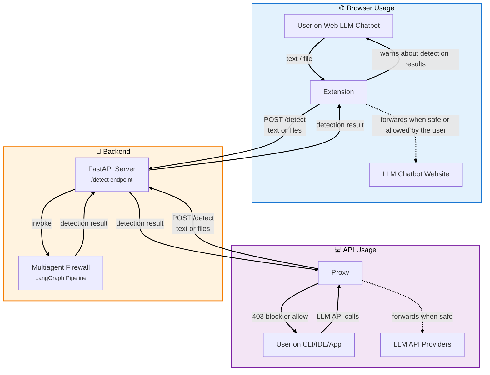

<div align="center">
    <br/>
    <p>
        
        <h1>Minos Verdict Mesh</h1>
    </p>
    <p width="120">
        Modular architecture to inspect, evaluate, and enforce guardrails in LLM interactions.
    </p>
    <br/>
</div>

## Architecture



## Set up 

### 1. uv
Install [uv](https://docs.astral.sh/uv/#installation) (modern Python package manager):

### 2. Configure package options
- `backend`: Copy `backend/.env.example` to `backend/.env` (server settings).
- `multiagent-firewall`: Copy `multiagent-firewall/.env.example` to `multiagent-firewall/.env` (LLM, OCR, NER settings). Customize detection pipeline via `multiagent-firewall/config/pipeline.json` and detection options via `multiagent-firewall/config/detection.json`.
- `proxy`: Copy `proxy/.env.example` to `proxy/.env` and configure to your liking.
- `extension`: Modify `extension/src/config.js`

### 3. Run backend server
The backend package simplifies the connection between the `proxy` and `extension` modules.

```bash
cd backend && uv sync && uv run python -m app.main
```

> [!NOTE]
> Alternatively, you can build the `backend` image using the provided Dockerfile:
> ```bash
> docker build -t minos-verdict-mesh .
> docker run -p 8000:8000 --env-file .env minos-verdict-mesh
> ```

### 4a. Load extension
1. Go to chrome://extensions/
2. Toggle on "Developer mode"
3. Click "Load unpacked" → choose path to `minos-verdict-mesh/extension/`

The extension will intercept web chatbot interactions (ChatGPT, Gemini...) and provide feedback to the user about policy findings and configured guardrail decisions.

### 4b. Run proxy

Detailed information on how to run the proxy package under `proxy/README.md`

The proxy will act as a middleman between the user and any listed endpoint under `proxy/.env`

## License

MIT license.
