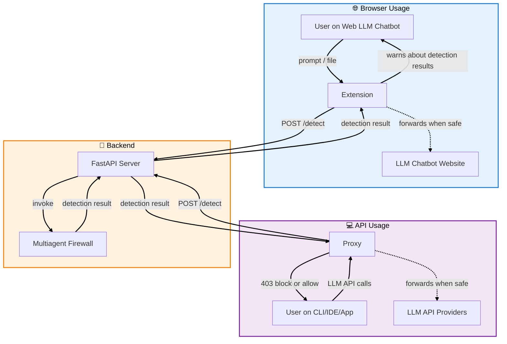

<div align="center">
    <br/>
    <p>
        
        <h1>Minos Verdict Mesh</h1>
    </p>
    <p width="120">
        Modular architecture to inspect, evaluate, and enforce guardrails in LLM interactions.
    </p>
    <br/>
</div>

## Architecture



## Set up 

### 1. uv
Install [uv](https://docs.astral.sh/uv/#installation)

### 2. Configure package options

| Package | Configuration files |
| --- | --- |
| `backend` | `backend/.env` |
| `proxy` | `proxy/.env` |
| `extension` | `extension/src/config.js` |
| `multiagent-firewall` | `multiagent-firewall/.env`, `multiagent-firewall/config/detection.json` and `multiagent-firewall/config/pipeline.json` |

> [!NOTE]
> All `.env` configuration files must be manually created. An `.env.example` of each is uploaded for reference.

### 3. Run backend server
The backend package simplifies the connection between the sensor and the firewall package.

```bash
cd backend && uv sync && uv run python -m app.main
```

> [!NOTE]
> Alternatively, you can build the `backend` image using the provided Dockerfile:
> ```bash
> docker build -t minos-verdict-mesh .
> docker run -p 8000:8000 --env-file .env minos-verdict-mesh
> ```

### 4a. Load extension
1. Go to chrome://extensions/
2. Toggle on "Developer mode"
3. Click "Load unpacked" → choose path to `minos-verdict-mesh/extension/`

The extension will intercept web chatbot interactions and provide feedback to the user about policy findings and configured guardrail decisions.

### 4b. Run proxy

Detailed information on how to run the proxy package under `proxy/README.md`

The proxy will act as a middleman between the user and any listed endpoint under `proxy/.env`

## License

MIT license.
